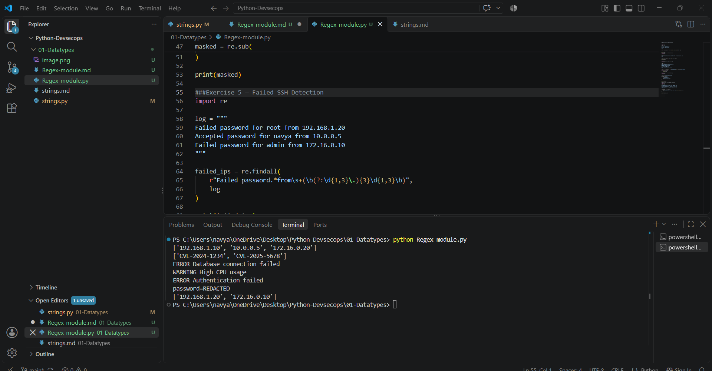

# 🎯 What I want you to practice

#Do these **5 hands-on exercises**:

### Exercise 1 — IP extraction

import re

log = """
Server1: 192.168.1.10
Server2: 10.0.0.5
Server3: 172.16.0.20
"""

ips = re.findall(r"\b(?:\d{1,3}\.){3}\d{1,3}\b", log)

print(ips)

### Exercise 2 — CVE Extraction Found CVE-2024-1234 and CVE-2025-5678 during security scan
#Trivy output
#Snyk output
#application logs
#security reports
#dependency scan results

import re

text = """
Found CVE-2024-1234 and CVE-2025-5678 during security scan
"""

cves = re.findall(r"CVE-\d{4}-\d+", text)

print(cves)

#CVE-2024-1234
│   │    │
│   │    └── \d+
│   └─────── \d{4}
└─────────── CVE- 
### Exercise 3 — Log Filtering
#Given:
#INFO Application started
#ERROR Database connection failed
#WARNING High CPU usage
#INFO User logged in
#ERROR Authentication failed

#We want only:
#ERROR Database connection failed
#WARNING High CPU usage
#ERROR Authentication failed

import re

log = """
INFO Application started
ERROR Database connection failed
WARNING High CPU usage
INFO User logged in
ERROR Authentication failed
"""

lines = re.findall(r"^(?:ERROR|WARNING).*$", log, re.MULTILINE)

for line in lines:
    print(line)
    
###Exercise 4 — Secret Masking

Convert:

password=MySecret123 into: password=REDACTED

import re

text = "password=MySecret123"

masked = re.sub(
    r"password=\S+",
    "password=REDACTED",
    text
)

print(masked)

#Output
password=REDACTED
Understand the regex
password=\S+
password=

We literally look for:
password=
Then:
\S+ : One or more non-whitespace characters.
So:MySecret123 gets matched.
The complete match is:
password=MySecret123
Then:

re.sub(...)

replaces it with:

password=REDACTED

#Remember:

re.findall() → find
re.search()  → find
re.sub()     → replace
🛡️ Real DevSecOps scenario

#Imagine a CI/CD log accidentally contains:

DB_PASSWORD=SuperSecret123
API_TOKEN=abc123xyz

A log-sanitization script could detect and mask sensitive values before storing or displaying logs.

Important: Regex masking is only a basic technique; real secret scanning should use dedicated tools and carefully designed rules.

###Exercise 5 — Failed SSH Detection

This one is especially useful for your Linux + Security + Python preparation.

Input
Failed password for root from 192.168.1.20
Accepted password for navya from 10.0.0.5
Failed password for admin from 172.16.0.10

We only want:

192.168.1.20
172.16.0.10
Code

import re

log = """
Failed password for root from 192.168.1.20
Accepted password for navya from 10.0.0.5
Failed password for admin from 172.16.0.10
"""

failed_ips = re.findall(
    r"Failed password.*from\s+(\b(?:\d{1,3}\.){3}\d{1,3}\b)",
    log
)

print(failed_ips)

#Output
['192.168.1.20', '172.16.0.10']
Let's understand this carefully

#The important part is:

Failed password.*from\s+(\b(?:\d{1,3}\.){3}\d{1,3}\b)
First:
Failed password

We only want lines containing:

Failed password

Therefore this line:

Accepted password for navya from 10.0.0.5

doesn't match.

Next:
.*

means:

Anything between Failed password and from.

So:

Failed password for root from

matches.

Then:
from\s+

from literally matches:

from

\s+ means:

One or more spaces/whitespace characters.

Then comes our IP regex:
\b(?:\d{1,3}\.){3}\d{1,3}\b

You already learned this one! 😎

It finds:

192.168.1.20

or:

172.16.0.10
⭐ Why are there () around the IP?

This is very important.

( \b(?:\d{1,3}\.){3}\d{1,3}\b )

The parentheses create a capturing group.

Because we're using:

re.findall()

Python returns the content of the capturing group.

So instead of returning the entire line:

Failed password for root from 192.168.1.20

it returns only:

192.168.1.20

🔥 That's a very useful Regex concept for you.

