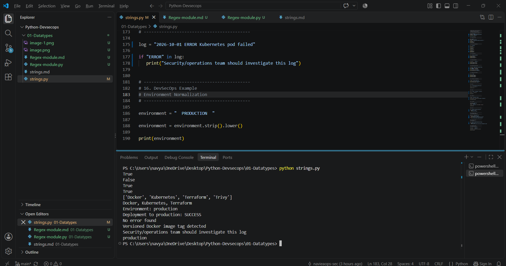

 Python Strings

## 1. What is a String?

A string is a sequence of characters enclosed inside single quotes,
double quotes, or triple quotes.

Examples:

```python
name = "Navya"
environment = 'production'
message = """Security scan completed"""

Strings are commonly used for:

Log messages
File names
Environment names
URLs
Docker image names
API responses
Configuration values
Error messages
Important String Characteristics
Strings are:
Ordered
Indexed
Iterable
Immutable

Example:

text = "DevSecOps"

print(text[0])
print(text[-1])

Output:

D
s

When your interviewer asks:

"Have you practiced Python string methods?"

You can actually open this file and demonstrate:

Creating strings
      ↓
Indexing / slicing
      ↓
len()
      ↓
upper/lower/capitalize/title
      ↓
strip/lstrip/rstrip
      ↓
split/join
      ↓
replace
      ↓
find/count
      ↓
startswith/endswith
      ↓
isdigit/isalpha/isalnum/isspace
      ↓
in/not in
      ↓
f-strings
      ↓
DevSecOps examples


3. len()

Returns the number of characters in a string.

text = "DevSecOps"

print(len(text))

Output:

9
DevSecOps Example

Used when validating names, tokens, filenames, configuration values, etc.

4. upper()

Converts characters to uppercase.

environment = "production"

print(environment.upper())

Output:

PRODUCTION
5. lower()

Converts characters to lowercase.

environment = "PRODUCTION"

print(environment.lower())

Output:

production
DevSecOps Example

Useful when comparing values where capitalization should not matter.

6. strip()

Removes leading and trailing whitespace.

environment = "   production   "

print(environment.strip())

Output:

production
DevSecOps Example

Useful when processing values received from:

Configuration files
CSV files
User input
CLI output
Logs
7. split()

Splits a string into a list.

tools = "Docker,Kubernetes,Terraform"

result = tools.split(",")

print(result)

Output:

['Docker', 'Kubernetes', 'Terraform']
Important

split() returns a list.

8. join()

Combines elements into a string.

tools = ["Docker", "Kubernetes", "Terraform"]

result = ", ".join(tools)

print(result)

Output:

Docker, Kubernetes, Terraform
Important

join() is commonly used to convert a list into a string.

9. replace()

Replaces one part of a string with another.

message = "Environment: testing"

result = message.replace("testing", "production")

print(result)

Output:

Environment: production
10. find()

Returns the position of a substring.

text = "Docker container failed"

print(text.find("container"))
11. count()

Counts how many times something appears.

log = "ERROR ERROR WARNING ERROR"

print(log.count("ERROR"))

Output:

3
12. startswith()

Checks whether a string starts with specific text.

filename = "security_report.json"

print(filename.startswith("security"))
13. endswith()

Checks whether a string ends with specific text.

filename = "security_report.json"

print(filename.endswith(".json"))
DevSecOps Example

Useful for identifying:

.json
.yaml
.tf
.log
.sh

files.

14. String Membership
in
log = "ERROR: Kubernetes pod failed"

print("ERROR" in log)
not in
log = "Deployment completed successfully"

print("ERROR" not in log)
DevSecOps Example

Useful for searching logs for:

ERROR
WARNING
FAILED
CRITICAL
unauthorized
15. f-strings

Used to insert variables into strings.

environment = "production"
status = "SUCCESS"

message = f"Deployment to {environment}: {status}"

print(message)

Output:

Deployment to production: SUCCESS
DevSecOps Example

Useful for generating:

Deployment messages
Security reports
Notifications
Log messages
CLI output
String Immutability

Strings are immutable.

This means that after creating a string, we cannot directly change
individual characters of that existing string.

Example:

text = "Docker"

# This is not allowed:
# text[0] = "d"

Instead, Python creates a new string:

text = text.lower()

print(text)
Real-World DevSecOps Example

Suppose a security tool generates:

"  CRITICAL: Vulnerability found in nginx  "

We can process it:

finding = "  CRITICAL: Vulnerability found in nginx  "

finding = finding.strip().lower()

print(finding)

Result:

critical: vulnerability found in nginx

This kind of string processing is useful when automating
security reports and log analysis.

Interview Questions
Q1. What is a string in Python?

A string is an ordered sequence of characters enclosed in quotes.
Python strings are immutable.

Q2. Are strings mutable?

No. Strings are immutable.

Q3. What is the difference between split() and join()?

split() converts a string into a list.

join() combines elements of an iterable, commonly a list, into a string.

Q4. What is the difference between find() and count()?

find() returns the position of a substring.

count() returns how many times a substring occurs.

Q5. How would you search for ERROR in a log?
if "ERROR" in log:
    print("Error found")
Q6. Give a DevSecOps use case for strings.

Strings are heavily used when processing logs, security scan results,
Docker image names, file paths, environment variables, configuration
values and API responses.

