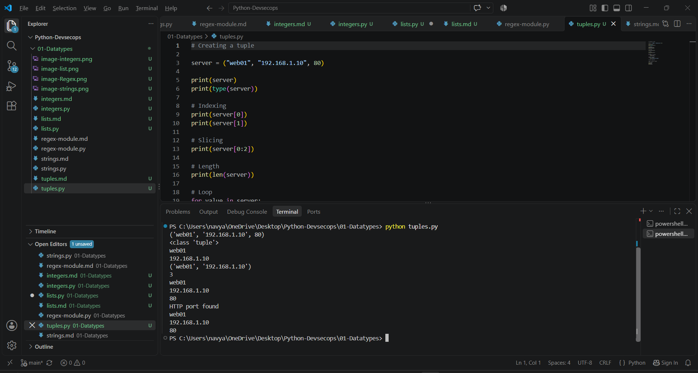

Python Tuples

A tuple is an ordered and immutable collection.

server = ("web01", "192.168.1.10", 80)

#Characteristics
Ordered
Immutable
Allows duplicates
Supports indexing
Supports slicing

We Use tuples when data should not be changed.

Example:

server = ("web01", "192.168.1.10", 80)
Tuple Unpacking
name, ip, port = server

This assigns each tuple value to a variable.

DevSecOps Example

Tuples can represent fixed information such as:

server = ("web01", "10.0.0.5", 443)

where:

web01 = server
10.0.0.5 = IP
443 = port

